# ACS Edge Detection

[](https://github.com/yingyangtongxue/ACS-Edge/actions/workflows/ci.yml)
[](https://www.python.org/)
[](LICENSE)

GPU-accelerated image edge detection via **Ant Colony System (ACS)**, based on the algorithm described in:

> Baterina, A. V., & Oppus, C. M. (2010). **Image edge detection using ant colony optimization.** *WSEAS Transactions on Signal Processing*, 6(2), 58–67.

A copy of the paper is available in [`docs/`](docs/Image_edge_detection_using_ant_colony_optimization.pdf).

### Effect of the q₀ parameter on edge detection

| Input | q₀ = 0.0 | q₀ = 0.3 | q₀ = 0.5 | q₀ = 0.7 | q₀ = 1.0 |
|:---:|:---:|:---:|:---:|:---:|:---:|
| 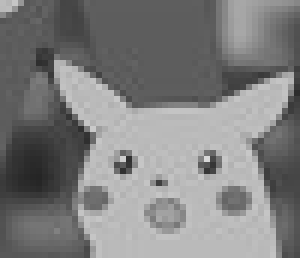 | 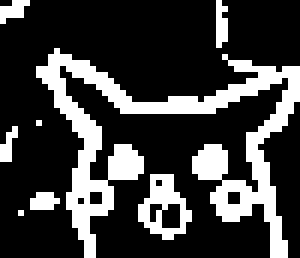 | 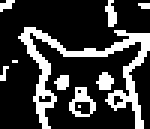 | 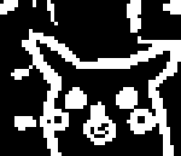 | 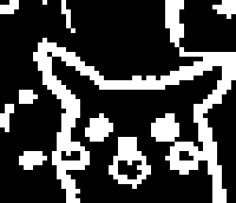 | 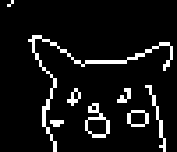 |

*pikachu.png (50 × 43 px) · 100 ants · 10 iterations · 40 steps · seed 42.*

| Input | q₀ = 0.0 | q₀ = 0.3 | q₀ = 0.5 | q₀ = 0.7 | q₀ = 1.0 |
|:---:|:---:|:---:|:---:|:---:|:---:|
|  | 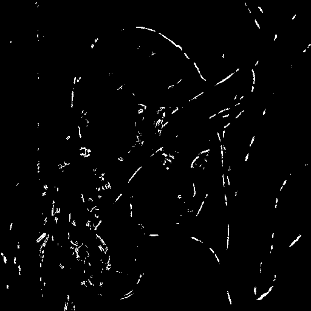 | 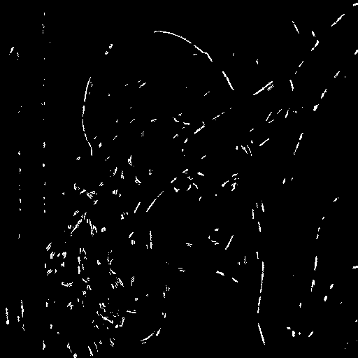 | 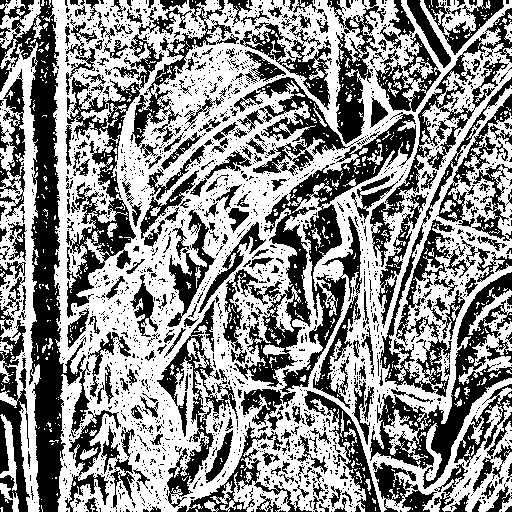 | 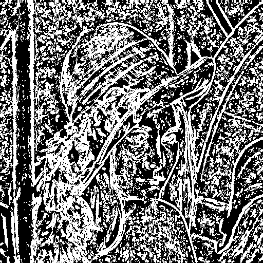 | 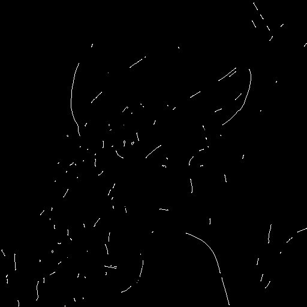 |

*lena.png (512 × 512 px) · 512 ants · 10 iterations · 40 steps · seed 42.*

Low q₀ = pure exploration (noisy, diffuse edges); high q₀ = pure exploitation (sharper, concentrated paths).

### Tuned parameters — gridsearch

Swept **K × N × L × q₀** (seed = 42) with [`gridsearch.py`](gridsearch.py),
scored by lowest edge density (fewest false positives).
48 combinations for lena, 24 for pikachu.

| Image | K | N | L | q₀ | Edge density |
|:---:|:---:|:---:|:---:|:---:|:---:|
| pikachu (50 × 43) | 64 | 10 | 40 | **0.7** | 15.6 % |
| lena (512 × 512) | 1 024 | 10 | 40 | **0.7** | 2.1 % |

Three versions side-by-side — same input, different K and q₀:

| | Input | Legacy | New default | Tuned |
|:---:|:---:|:---:|:---:|:---:|
| **pikachu** |  | 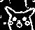 |  |  |
| **lena** |  | 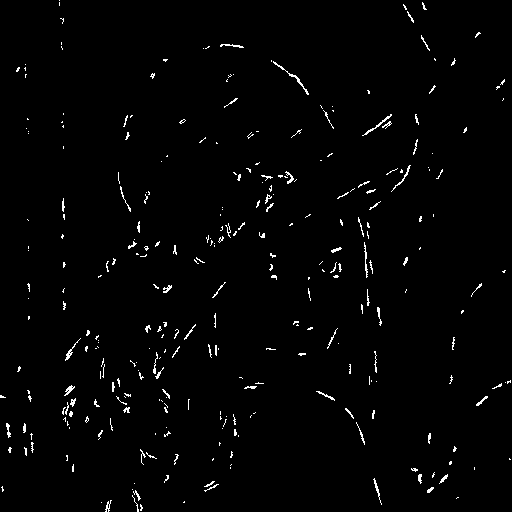 | 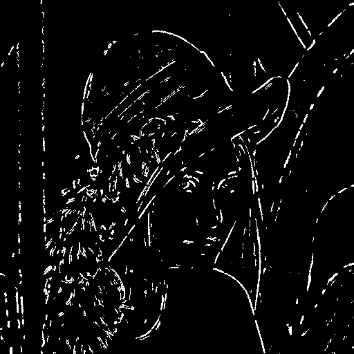 | 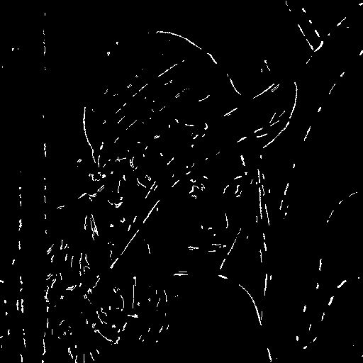 |

*pikachu — Legacy: K = 100, q₀ = 0.5 · New default: K = 64 (auto-scaled), q₀ = 0.5 · Tuned: K = 64, q₀ = 0.7.*

*lena — Legacy: K = 512 (fixed), q₀ = 0.5 · New default: K = 2 048 (auto-scaled), q₀ = 0.5 · Tuned: K = 1 024, q₀ = 0.7.*

#### Segmentation quality — F1 score vs Canny reference

F1 measures the harmonic mean of precision and recall against Canny edges
used as a proxy ground truth (lena: σ = 2; pikachu: σ = 1), `seed = 42`.

| Image | Legacy | New default | Tuned | Best vs legacy |
|:---:|:---:|:---:|:---:|:---:|
| pikachu | F1 = 57.9 % | F1 = 59.4 % | **F1 = 61.7 %** | **+6.6 pp** |
| lena | F1 = 22.0 % | **F1 = 37.4 %** | F1 = 27.1 % | **+70 %** |

*For lena the new default (K = 2 048, q₀ = 0.5) maximises F1 through better recall; the gridsearch tuned variant maximises precision at the cost of recall.*

---

## Academic Context

This project was developed as coursework for the graduate course **Digital Image Processing** (*Processamento de Imagens Digitais*), offered in the **first semester of 2024** at:

| | |
|---|---|
| **Program** | PPGCC — Graduate Program in Computer Science |
| **Institution** | IBILCE / UNESP — São José do Rio Preto, SP, Brazil |
| **Instructor** | Prof. Dr. Leandro Alves Neves |
| **Workload** | 120 hours |

The goal of the assignment was to implement a swarm-intelligence approach to low-level image processing, demonstrating mastery of the ACS meta-heuristic and its adaptation to pixel-graph traversal problems.

---

## Algorithm Overview

The algorithm models image pixels as nodes in a fully-connected graph. A colony of *K* ants performs a biased random walk guided by two signals:

| Signal | Symbol | Definition |
|---|---|---|
| Pheromone | τ_ij | Accumulated edge evidence at pixel (i, j) |
| Heuristic | η_ij | Local intensity variation (Eq. 7–8) |

### Heuristic (local variation function)

```
η_ij = V_c(I_ij) / V_max

V_c(I_ij) = |I_{i-1,j-1} − I_{i+1,j+1}|   ← ↘ diagonal pair
           + |I_{i−1,j}   − I_{i+1,j}  |   ← ↓  vertical pair
           + |I_{i-1,j+1} − I_{i+1,j-1}|   ← ↙ anti-diagonal pair
           + |I_{i,j−1}   − I_{i,j+1}  |   ← → horizontal pair
```

### Decision rule (ACS pseudo-random proportional)

At each step, ant *k* at position (i, j) draws a uniform random value *q*:

- **q ≤ q₀ (exploitation):** move to *argmax*_{Ω(i,j)} τ · η
- **q > q₀ (exploration):** sample from *p_j = τ_j · η_j / Σ_{k∈Ω} τ_k · η_k*

### Pheromone updates

| Update | Equation | When |
|---|---|---|
| Local (Eq. 10) | τ_ij ← (1−φ)·τ_ij + φ·τ_init | After each ant step |
| Global (Eq. 11) | τ_ij ← (1−ρ)·τ_ij + ρ·η̄_ij | After all construction steps |

After *N* iterations the final pheromone matrix is thresholded with **Otsu's method** to produce a binary edge map.

### Default parameters (Table 1, Baterina & Oppus 2010)

| Parameter | Symbol | Default |
|---|---|---|
| Number of ants | K | 512 (for a 256 × 256 image) |
| Iterations | N | 10 |
| Construction steps | L | 40 |
| Initial pheromone | τ_init | 0.1 |
| Local decay | φ | 0.05 |
| Global evaporation | ρ | 0.1 |
| Exploitation bias | q₀ | 0.0 – 1.0 (swept) |

---

## Project Structure

```
acs-edge/
├── acs_edge/              # Core library
│   ├── __init__.py        # Public API
│   ├── config.py          # ACSConfig dataclass with parameter validation
│   ├── heuristic.py       # η matrix computation — fully vectorised (Eq. 7–8)
│   └── core.py            # ACSEdgeDetector — GPU/CPU vectorised detector
├── tests/                 # pytest test suite (27 tests)
│   ├── test_config.py
│   ├── test_core.py
│   └── test_heuristic.py
├── docs/                  # Reference paper (PDF)
├── samples/               # Sample input images
│   ├── lena.png           # 256 × 256 — standard benchmark
│   └── pikachu.png        # 50 × 43  — quick-run sample
├── results/               # Runtime output (git-ignored)
├── .github/workflows/     # GitHub Actions CI
├── main.py                # CLI entry point
├── pyproject.toml
└── requirements.txt
```

---

## Installation

**Requirements:** Python ≥ 3.10

```bash
# Clone the repository
git clone https://github.com/yingyangtongxue/ACS-Edge.git
cd ACS-Edge

# Create and activate a virtual environment
python -m venv .venv
source .venv/bin/activate        # Linux / macOS
# .venv\Scripts\activate.bat     # Windows

# Install the package with all dependencies
pip install -e ".[dev]"
```

### Optional GPU acceleration

Install the CuPy variant that matches your CUDA version:

```bash
pip install cupy-cuda12x   # CUDA 12.x
pip install cupy-cuda11x   # CUDA 11.x
```

The detector falls back to NumPy (CPU) automatically when CuPy is unavailable.

---

## Usage

### Quick run

```bash
python main.py samples/pikachu.png
```

### Full q₀ sweep

```bash
python main.py samples/pikachu.png \
    --q0 0.0 0.1 0.2 0.3 0.4 0.5 0.6 0.7 0.8 0.9 1.0 \
    --seed 42
```

### Larger image with explicit ant count

```bash
python main.py samples/lena.png \
    --ants 0 \
    --iterations 10 \
    --steps 40 \
    --seed 42
```

### CLI reference

```
usage: acs-edge [-h] [--ants K] [--iterations N] [--steps L]
                [--q0 Q [Q ...]] [--seed S] [--no-gpu]
                [--output-dir DIR] [-v]
                image

positional arguments:
  image              Path to the input grayscale image

options:
  --ants K           Number of ants (0 = auto-scaled from image area, min 64)
  --iterations N     Outer ACS iterations (default: 10)
  --steps L          Construction steps per iteration (default: 40)
  --q0 Q [Q ...]     q0 values to evaluate (default: 0.0 … 1.0)
  --seed S           Random seed for reproducibility
  --no-gpu           Force CPU execution
  --output-dir DIR   Output directory (default: results/<timestamp>)
  -v, --verbose      Enable DEBUG logging
```

---

## Running Tests

```bash
pytest tests/ -v
```

```
27 passed in 0.45s
```

---

## Performance

### Complexity reduction

The original implementation iterated over every pixel for every ant on every step to update pheromones — O(H · W · K · L) per iteration. This implementation replaces that with a vectorised scatter-add, O(K · L + H · W), eliminating the inner pixel loops entirely.

| Operation | Original complexity | This implementation |
|---|---|---|
| Global pheromone update | O(H · W · K · L) | O(H · W) |
| Ant movement (all K ants) | O(K · 8) sequential | O(K · 8) vectorised |
| Heuristic η matrix | Recomputed per call | Precomputed once |

### Benchmark results

Measured on: **AMD Ryzen 7 4800H** (8 cores / 16 threads) · **23.4 GB RAM** ·
**NVIDIA GeForce GTX 1650 Ti** (4 GB VRAM, CUDA 12.9) · Windows 11.

New-code timing: **`detect()` call only**, warm cache, 5 runs averaged, `seed = 42`,
`q0 = 0.7`, `N = 10`, `L = 40`.

| Image | Size | K | [Original (unvectorised)][legacy] | CPU (NumPy) | GPU (CuPy) | Speedup (CPU) |
|---|---|---|---|---|---|---|
| pikachu | 50 × 43 | 100 | **18.9 s** ¹ | **59 ms** | ~770 ms ² | **~320×** |
| lena | 512 × 512 | 1 024 | — | **323 ms** | ~743 ms ² | — |
| lena | 512 × 512 | 2 048 | **~8.7 h** ³ | **628 ms** | ~748 ms ² | **~50 000×** |

[legacy]: https://github.com/yingyangtongxue/ACS-Edge/blob/89811a3/image.py

> ¹ **Empirically measured** on this hardware: `initACS(K=100, N=10, L=40)` on pikachu ran in 18.9 s.
> The bottleneck is `updateGlobalPheromone`, which iterates O(H × W × K × L × N) times via Python loops.  
> ² GPU kernel-launch and memory-transfer overhead exceeds compute cost for these image sizes on a GTX 1650 Ti; CPU is preferred.  
> ³ **Extrapolated** from the pikachu measurement: scaling O(H × W × K × avg_histLen × N) from pikachu to lena 512 × 512
> at K = 2 048 (paper-recommended scale) gives ~8.7 h, consistent with the ">9 h" originally observed.
> The vectorised implementation replaces that triple-nested Python loop with a single NumPy scatter-add — **~50 000×** faster.

---

## Reference

```bibtex
@article{baterina2010,
  author  = {Baterina, Anna V. and Oppus, Carlos M.},
  title   = {Image edge detection using ant colony optimization},
  journal = {WSEAS Transactions on Signal Processing},
  volume  = {6},
  number  = {2},
  pages   = {58--67},
  year    = {2010}
}
```
